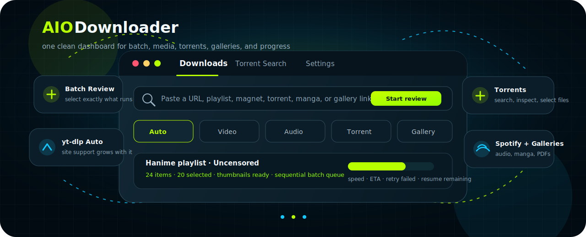

# AIO Downloader



**AIO Downloader** is a standalone local web dashboard for authorized direct
downloads, torrents, videos, audio, Spotify, manga, galleries, playlists,
profiles, and batch collections.

It was built from the reusable downloader ideas in
`cyanologyst/Telegram-Aio-Downloader`, but this project is intentionally
standalone: no Telegram bot, no upload flow, no zipping workflow, and no remote
file-manager surface.

> Only download content you own, created, licensed, or are otherwise authorized
> to access. AIO Downloader does not bypass DRM, CAPTCHA, paid access, account
> restrictions, or human-verification challenges.

## ✨ Highlights

- Modern Comfortaa-based Flask dashboard with dark/light UI.
- Desktop app window through pywebview, with rounded custom shell controls.
- Paste-time Auto detection through yt-dlp plus dedicated fallback resolvers.
- Batch Review modal before queuing multi-item pages.
- Select exact batch items, search within batches, pick ranges, or start presets.
- Resume remaining batch items after interruption without redownloading completed
  items.
- Skip current, pause after current, cancel remaining, retry failed, and continue
  after failed items.
- Live progress through Server-Sent Events with polling fallback.
- Download speed, percentage, ETA, size, current batch item, and aggregate batch
  progress.
- Thumbnail previews for supported batch items and proxied thumbnail loading for
  referrer-sensitive hosts.
- Torrent search, pagination, sorting, `.torrent` inspection, and per-file
  selection.
- Gallery/manga downloads with optional PDF conversion.

## 🧭 How Auto mode chooses a downloader

Auto mode tries the safest, most specific downloader first:

1. Spotify URL detection.
2. aria2 for obvious magnets, local torrent files, and torrent URLs.
3. yt-dlp with installed extractor support and Generic embedded-media probing.
4. Gallery/manga extraction.
5. aria2 direct HTTP fallback.

That means the supported video-site list is not frozen in this README. When
yt-dlp or a plugin learns a new site, AIO Downloader can usually learn it too.

## 📦 Batch downloading support

Batch downloads are reviewed before anything is queued. Large lists default to
the first 20 selected items so the app does not accidentally queue a giant
profile, studio, or playlist.

| Provider / site | Supported batch URL style | What the batch review shows | Notes |
|---|---|---|---|
| YouTube / yt-dlp playlists | Public playlist, channel, series, or other yt-dlp multi-item URL | Item title, URL, duration/size when yt-dlp exposes it, thumbnail when available | Works through yt-dlp's playlist extraction. Cookies may be required for restricted content. |
| Hanime | `https://hanime.tv/browse/brands/<brand>` | Studio/brand videos, titles, durations, thumbnails | Requires Deno and `hanime-plugin` support in the environment. |
| Hanime playlists | `https://hanime.tv/playlists/<playlist-id>` | Playlist videos, titles, thumbnails, available duration metadata | Public playlists are parsed from Hanime page data and visible playlist cards. |
| HentaiHaven series | `https://hentaihaven.com/video/<series>` | Episodes for the series, episode titles, shared poster thumbnail | Episodes are sorted naturally. |
| HentaiHaven studios | `https://hentaihaven.com/studio/<studio>` | All discoverable public episodes from the studio pages | Studio pages are crawled with retries; individual 5xx series failures are skipped instead of killing the whole batch. |
| HStream series | `https://hstream.moe/hentai/<series>` | Public series episode URLs | Episode-numbered pages are discovered from the series page. |
| PornHub model/profile | `https://www.pornhub.com/model/<name>` or `https://www.pornhub.com/pornstar/<name>` | Public profile videos and titles | Public pages only; cookies/proxy can be configured when authorized content requires them. |
| Generic yt-dlp playlist extractors | Any supported site where yt-dlp returns multiple entries | Flat playlist entries with titles, URLs, thumbnails, duration, or size when exposed | Useful for sites not explicitly implemented in this project. |

## 🎵 Spotify downloader

Spotify URLs are handled by the dedicated Spotify path through spotDL. It
supports tracks, albums, playlists, artists, shows, and episodes. This is not a
browser scrape: the downloader resolves Spotify metadata and saves audio through
spotDL's provider flow.

## 🌐 Social media and mainstream video

Social/video support is powered by yt-dlp first, so the app benefits from the
installed yt-dlp version and its extractor registry.

- **YouTube / youtu.be** — videos, audio extraction, playlists, and many
  multi-item pages.
- **TikTok** — public video URLs supported by yt-dlp.
- **Instagram** — public posts/reels supported by yt-dlp; login/cookies may be
  needed for restricted media.
- **X / Twitter** — public media URLs supported by yt-dlp when extractable.
- **Facebook** — public videos supported by yt-dlp; cookies may be required.
- **Vimeo, Dailymotion, Twitch** — handled through yt-dlp extractors.

For any other webpage, Auto mode still probes yt-dlp's Generic extractor before
falling back to gallery or direct-download logic.

## 🔞 Adult and hentai video providers

Dedicated labels, fallback logic, or yt-dlp extraction paths exist for:

- AlphaPorno, CamSoda, DrTuber, Empflix, Eporner
- HellPorno, HQPorner, JavHDPorn, Javtiful, LoveHomePorn
- MissAV and supported mirrors, Motherless, NJAV, NonkTube
- PornHub, PornTop, Porntrex, RedTube, Rule34Video
- Sexu, SpankBang, SunPorno, ThisVid, Thothub
- TNAFlix, Tube8, Txxx, WebCamera.pl
- XHamster, XNXX, XVideos, YouJizz, YouPorn, ZenPorn
- Hanime, HanimeRed, HStream, HentaiHaven, HentaiMama

Some providers use dedicated public-page resolution for direct media URLs.
Others are routed through yt-dlp. Cookies, proxy, or browser-exported cookies may
be required for sites that place content behind account, region, age, consent, or
anti-bot checks.

## 🖼️ Manga and galleries

- MangaDex chapter URLs
- nhentai-style page-by-page galleries
- E-Hentai-style public galleries where image URLs are discoverable
- Generic public pages exposing images through `src`, lazy-load attributes, or
  `srcset`

Galleries can be left as images or converted into a single PDF. The Settings tab
controls automatic PDF conversion and whether source images are removed after
PDF creation.

## 🧲 Torrents

AIO Downloader uses aria2 for magnets, remote/local `.torrent` files, and direct
HTTP/HTTPS files.

Torrent features:

- Magnet downloads with metadata-GID following into the real torrent job.
- Local `.torrent` inspection.
- Per-file selection before starting a torrent.
- Public index search through TPB/API Bay and RARBG-style endpoints.
- Optional Prowlarr integration for configured indexers.
- Search result pagination, sorting by seeders/date/size/leechers/title, and
  category filtering.

## 🧰 Requirements

- Python 3.11+
- aria2c
- ffmpeg
- Deno, for Hanime support
- Optional Prowlarr instance for multi-indexer torrent search
- Linux desktop mode may require GTK/WebKit packages for pywebview, depending
  on the distribution.

## 📦 Release format

Windows ships as a native **setup executable**:

- one `AIO-Downloader-Setup-vX.Y.Z.exe` file;
- installs the desktop app under the current user profile;
- bundles Python, app libraries, `yt-dlp`, `spotDL`, `aria2c`, `ffmpeg`,
  `ffprobe`, and Deno;
- installs Microsoft Edge WebView2 Runtime automatically when it is missing;
- creates Start Menu / optional desktop shortcuts and a normal uninstaller.

Windows setup command:

```powershell
.\scripts\package-windows-setup.ps1 -Version 1.0.0 -RebuildBundle
```

The portable folder/zip can still be generated for debugging:

```powershell
.\scripts\package-windows-bundle.ps1 -Version 1.0.0
```

macOS and Ubuntu packaging will be added later as platform-specific installers.

## 🚀 Windows development install

```powershell
python -m venv .venv
.\.venv\Scripts\Activate.ps1
python -m pip install --upgrade pip
python -m pip install -r requirements.txt
Copy-Item .env.example .env
```

Or use the release runner, which opens the desktop app window:

```powershell
Set-ExecutionPolicy -Scope Process Bypass
.\scripts\run-windows.ps1
```

If system tools are missing:

```powershell
winget install aria2.aria2
winget install Gyan.FFmpeg
winget install DenoLand.Deno
```

Edit `.env` after copying it from `.env.example`.

## 🍎 macOS / 🐧 Ubuntu quick start

Install Python 3.11+, `ffmpeg`, `aria2`, and Deno with your package manager,
then run:

```bash
chmod +x scripts/run-unix.sh
./scripts/run-unix.sh
```

## ▶️ Run

```powershell
.\.venv\Scripts\python.exe -m app.desktop
```

For development, you can still run the plain local web server:

```powershell
.\.venv\Scripts\python.exe -m app.main
```

By default, the local server bridge uses `http://127.0.0.1:5050`, but desktop
mode falls back to an available local port if 5050 is already occupied.

## ⚙️ Configuration

Important `.env` settings:

```dotenv
DOWNLOAD_DIR=Download
WEB_HOST=127.0.0.1
WEB_PORT=5050
YTDLP_COOKIES_FILE=
YTDLP_PROXY=
DENO_BIN=
DEFAULT_VIDEO_QUALITY=best
DEFAULT_AUDIO_FORMAT=mp3
MAX_CONCURRENT_DOWNLOADS=2
MANGA_AUTO_CONVERT_PDF=true
MANGA_REMOVE_IMAGES_AFTER_PDF=false
TPB_API_URL=https://apibay.org
RARBG_BASE_URL=https://rargb.to
PROWLARR_URL=http://127.0.0.1:9696
PROWLARR_API_KEY=
PROWLARR_SEARCH_LIMIT=20
```

Prowlarr remains disabled until an API key is supplied.

## 🔌 API surface

- `GET /`
- `GET /api/health`
- `GET /api/events`
- `POST /api/downloads/start`
- `GET /api/downloads`
- `DELETE /api/downloads/finished`
- `POST /api/downloads/<job_id>/pause`
- `POST /api/downloads/<job_id>/resume`
- `POST /api/downloads/<job_id>/cancel`
- `POST /api/downloads/<job_id>/skip`
- `POST /api/downloads/<job_id>/retry-failed`
- `POST /api/downloads/<job_id>/resume-batch`
- `POST /api/batches/inspect`
- `GET /api/batches/<manifest_id>`
- `POST /api/batches/<manifest_id>/start`
- `POST /api/torrents/inspect`
- `GET /api/torrents/search`
- `POST /api/torrents/resolve`
- `GET /api/settings`
- `POST /api/settings`
- `POST /api/pdf/convert`
- `POST /api/ytdlp/probe`
- `GET /api/ytdlp/thumbnail`

## 🧪 Tests

```powershell
python -m pip install -r requirements-dev.txt
python -m pytest
```

## 🧹 Publish-safe files

Runtime data is intentionally ignored:

- `.env`
- `.venv/`
- `Download/`
- `logs/`
- `config/jobs.json`
- `config/batches/`
- `config/settings.json`
- Python and pytest caches

The repository should contain source code, tests, documentation, requirements,
the env template, and static README assets only.

## ⚠️ Limitations

- yt-dlp and spotDL subprocesses support cancellation, but not portable
  pause/resume. aria2 jobs support pause/resume.
- RARBG-style mirrors may disappear, rate-limit, or require human verification.
- Cookies may be required for age gates, consent pages, private pages, or content
  the user is already authorized to access.
- CAPTCHA, DRM, paid access, account restrictions, and human-verification
  challenges are not bypassed.
- Site support can change when providers change their markup, APIs, or player
  behavior.

## 📜 License

Add your preferred license before distributing publicly.
